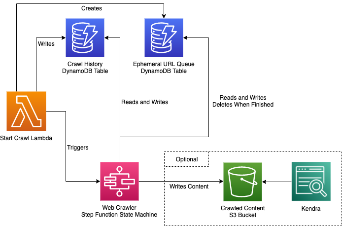
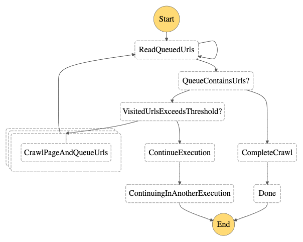
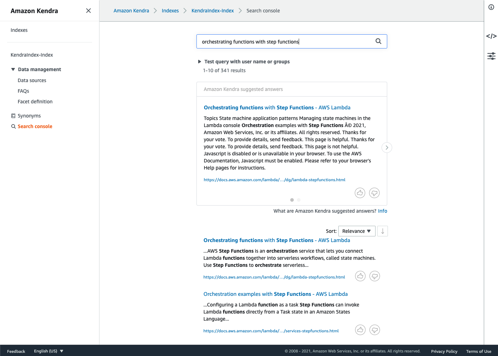

# 🕷Serverless Web Crawler and Search Engine with Step Functions and Kendra

## Overview
This sample aims to demonstrate how to create a serverless web crawler (or web scraper) using [AWS Lambda](https://aws.amazon.com/lambda/) and [AWS Step Functions](https://aws.amazon.com/step-functions/).
It scales to crawl large websites that would time out if we used just a single lambda to crawl a site. The web crawler is written in
Typescript, and uses [Puppeteer](https://github.com/puppeteer/puppeteer) to extract content and URLs from a given webpage.

Additionally, this sample demonstrates an example use-case for the crawler by indexing crawled content into [Amazon Kendra](https://aws.amazon.com/kendra/), providing
a machine-learning powered search over our crawled content. The CloudFormation stack for the Kendra resources is optional,
you can deploy just the web crawler if you like. Make sure to review [kendra's pricing and free tier](https://aws.amazon.com/kendra/pricing/)
before deploying the kendra part of the sample.

The [AWS Cloud Development Kit (CDK)](https://aws.amazon.com/cdk/) is used to define the infrastructure for this sample as code.

## Architecture



* The Start Crawl Lambda is invoked with details of the website to crawl.
* The Start Crawl Lambda creates a Dynamo DB table which will be used as the URL queue for the crawl.
* The Start Crawl Lambda writes the initial URLs to the queue.
* The Start Crawl Lambda triggers an execution of the web crawler state machine (see the section below).
* The Web Crawler State Machine crawls the website, visiting URLs it discovers and optionally writing content to S3.
* Kendra provides us with the ability to search our crawled content in S3.

## The Web Crawler

The web crawler is best explained by the AWS Step Functions State Machine diagram:



* Read Queued Urls: Reads all non-visited URLs from the URL queue DynamoDB table.
* Crawl Page And Queue Urls: Visits a single webpage, extracts its content, and writes new URLs to the URL queue. This step is executed
in parallel across a batch of URLs. Batch size is configured in `lambda/config/constants.ts`.
* Continue Execution: This is responsible for spawning a new state machine execution as we approach the [execution history limit](https://docs.aws.amazon.com/step-functions/latest/dg/bp-history-limit.html).
* Complete Crawl: Delete the URL queue DynamoDB table and trigger a sync of the Kendra data source if applicable.

## Prerequisites

* The [aws-cli](https://docs.aws.amazon.com/cli/latest/userguide/cli-chap-install.html) must be installed *and* configured with an AWS account with a profile (see https://docs.aws.amazon.com/cli/latest/userguide/cli-chap-install.html for instructions on how to do this on your preferred development platform). Please ensure your profile is configured with a default AWS region.
* This project requires [Node.js](http://nodejs.org/) ≥ 16 and [NPM](https://npmjs.org/) ≥ 8.3.0.
To make sure you have them available on your machine, try running the following command.
```sh
npm -v && node -v
```
* Install or update the [AWS CDK CLI](https://docs.aws.amazon.com/cdk/latest/guide/getting_started.html#getting_started_install) from npm. This uses CDK v2.
```sh
npm i -g aws-cdk
```
* [Bootstrap your AWS account for CDK](https://docs.aws.amazon.com/cdk/latest/guide/bootstrapping.html) if you haven't done so already

## Deploy

This repository provides a utility script to build and deploy the sample.

To deploy the web crawler on its own, run:

`./deploy --profile <YOUR_AWS_PROFILE>`

Or you can deploy the web crawler with Kendra too:

`./deploy --profile <YOUR_AWS_PROFILE> --with-kendra`

Note that if deploying with Kendra, ensure your profile is configured with one of the AWS regions that supports Kendra. See [the AWS Regional Services List](https://aws.amazon.com/about-aws/global-infrastructure/regional-product-services/) for details.

## Run The Crawler

When the infrastructure has been deployed, you can trigger a run of the crawler with the included utility script:

`./crawl --profile <YOUR_AWS_PROFILE> --name lambda-docs --base-url https://docs.aws.amazon.com/ --start-paths /lambda --keywords lambda/latest/dg`

You can play with the arguments above to try different websites.

* `--base-url` is used to specify the target website to crawl, only URLs starting with the base url will be queued.
* `--start-paths` specifies one or more paths in the website to start at.
* `--keywords` parameter filters the URLs which are queued to only ones containing one or more of the given keywords, (ie above, only URLs containing `lambda/latest/dg`
are added to the queue)
* `--name` is optional, and is used to help identify which step function execution or dynamodb table corresponds to which crawl.

The `crawl` script will print a link to the AWS console so you can watch your Step Function State Machine execution in action.

## Search Crawled Content

If you also deployed the Kendra stack (`--with-kendra`), you can visit the Kendra console to see an example
search page for the Kendra index. The `crawl` script will print a link to this page if you deployed Kendra. Note that it will
take a few minutes once the crawler has completed for Kendra to index the newly stored content.



## Run The Crawler Locally

If you're playing with the core crawler logic, it might be handy to test it out locally.

You can run the crawler locally with:

`./local-crawl --base-url https://docs.aws.amazon.com/ --start-paths /lambda --keywords lambda/latest/dg`

## Cleaning Up

You can clean up all your resources when you're done via the `destroy` script.

If you deployed just the web crawler:

`./destroy --profile <YOUR_AWS_PROFILE>`

Or if you deployed the web crawler with Kendra too:

`./destroy --profile <YOUR_AWS_PROFILE> --with-kendra`

## Security

See [CONTRIBUTING](CONTRIBUTING.md#security-issue-notifications) for more information.

## License

This library is licensed under the MIT-0 License. See the [LICENSE](LICENSE) file.
